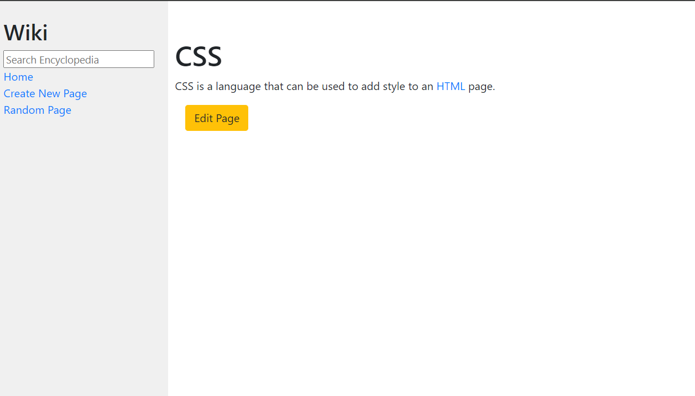

# PROJECT1 WEB PROGRAMMING WITH PYTHON AND JAVASCRIPT

PROJECT1 DE LA PROGRAMMATION AVEC PYTHON ET JAVASCRIPT DE HARVARD (CS50WEB)
le but de l'exercice est de créer un site dynamique en utilisant le framework PYTHON DJANGO.
ce projet est très semblable à wikipedia.
les technologies utilisées pour ce travail sont HTML, CSS, PYTHON, DJANGO, MARKDOWN.
"Markdown : est un langage de balisage comme html mais très facile d'utilisation."
le travail consistait a: 

1. ajouter des liens sur la page d'accueil de tel sorte qu'un utilisateur puisse lire le contenu de chaque page.
   

2. créer une page d'ajout de contenu des pages comme la page de css, javascript.
   

3. créer une page d'édition de chaque page c'est a dire un utilisateur peur changer le titre et meme le ciontenu de la page.
    
4. créer une page aléatoire : c'est dire lorsqu'on clique sur random a page , une page au hasard est affichée.

5. créer la recherche des pages, donc un utilisateur peut rechercher une page spécifique si elle existe, son contenu est afficher ou si l'élément de recherche est similaire à une cette page est listée, et l'utilisateur peut y accéder sans problème et si elle n'existe une page d'erreur est affiche.
    


## TEST DU PROJECT  

    **
        telechargez ou bien cloner le projet et la racine du project , executez les commenade suivante.
    **
    *activer l'environement virtuel*
        ```
            project1\Scripts\activate
        ```  
    *install django*
    ```
        pip install django
    ```

    *une fois django installer acceder au project en executant la commande suivante*
    ```
        python manage.py runserver
    ```

**envoyer moi des messages depuis mon portfolio meme si c'est juste pour me faire coucou**
*[mon portfolio](https://ruceldev.web.app)*
